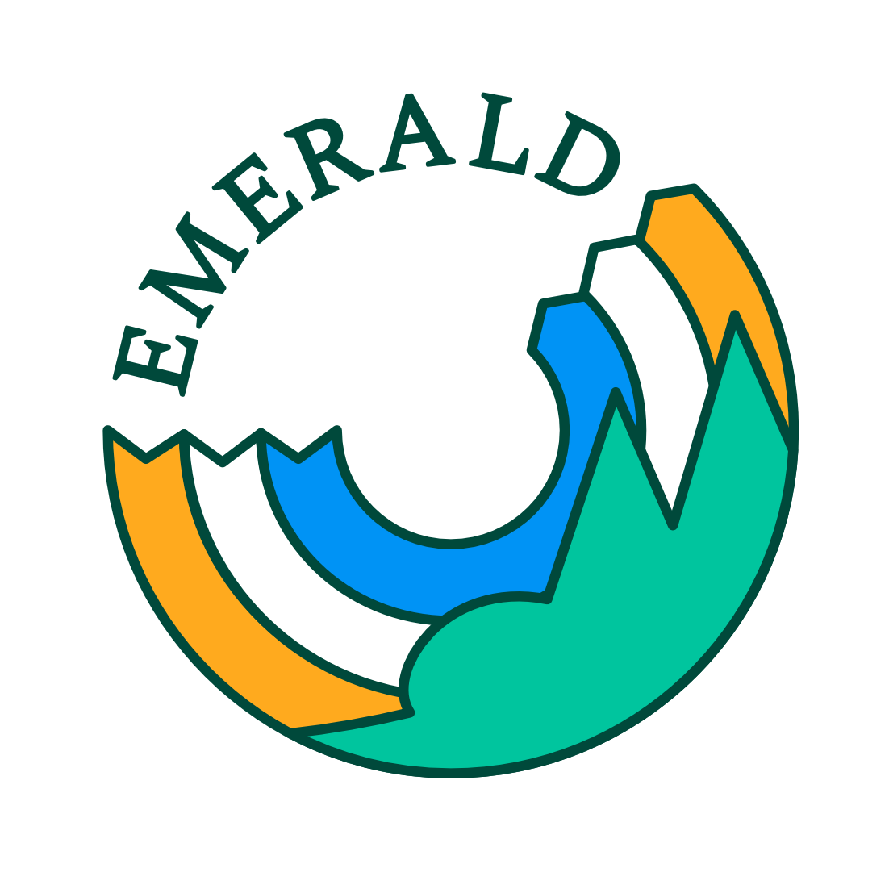

{:height="50%" width="30%"}

# Platform for NorESM site-level simulation over land

###### doi:

## Overview and documentation
The platform aims to facilitate the site-level simulations over land using [NorESM](https://github.com/NorESMhub/NorESM) and its land component [CTSM](https://github.com/NorESMhub/CTSM) with the developing vegetation demographic module [FATES](https://github.com/NGEET/fates). It privdes **optimized model setup, input data and reproducible workflows for running the model and analyzing model output over sites** with meteorological, ecological and hydrological observations accross Nordic regions without techincal obstacles. 

The platform aims to bridge the gaps between observation and model, and **promote the usage of site-level observations to test, validate and improve the NorESM** and its land component on the one hand, and **promote the usage of the NorESM and its land model component by non-modellers** on the other hand. 

The [observation sites]() currently included in the platform

For more information on the platform, please see our [wiki]() and [technical documentation]().

## Quick guides for using the platform

* ### Modeller: *Workflows for developing and using the platform*
  - See [documentation]()

* ### Non-Modeller: *GALAXY tools, workflows and tutorials*
  - A graphic user interface for running site-level simulation is available on the cloud computing platform [GALAXY](https://galaxyproject.org/) as a tool (CTSM/FATES-EMERALD), with a dedicated [tutorial](https://training.galaxyproject.org/training-material/topics/climate/tutorials/fates/tutorial.html) and [workflows]() for its usage. 
  - Please contact [Anne Fouilloux](https://github.com/annefou) for the development of GALAXY tools related to the platform.
   
## Code development team
* [Hui Tang](https://github.com/huitang-earth)
* [Anne Fouilloux](https://github.com/annefou)
* [Elin Aas](https://github.com/ecaas)
* [Lasse Torben Keetz](https://github.com/lasseke)
* [Yeliz Yilmaz](https://github.com/yelizy/)
* Eva Lieungh
* Peter Horvath
* [Kjetil Aas](https://github.com/kjetilaas)
* [Sunniva Indrehus](https://github.com/sunnivin)
* [Devaraju Narayanappa](https://github.com/devarajun)

## Data contributors
* [Sonya Geange](https://github.com/srg101)
* Inge Althuizen

## Supporting projects
* [EMERALD](https://www.mn.uio.no/geo/english/research/projects/emerald/)
* [LATICE](https://www.mn.uio.no/geo/english/research/groups/latice/)
* [SeedClim](https://www.uib.no/en/rg/EECRG/55395/seedclim)
* [LandPress](https://www.uib.no/en/rg/EECRG/95156/landpress)
* [THREE-D](https://www.uib.no/en/rg/EECRG/126712/three-d)
* [INES](https://www.ines.noresm.org/)
* [EOSC-Nordic](https://www.eosc-nordic.eu/)

## How to cite

## Acknowledgement
