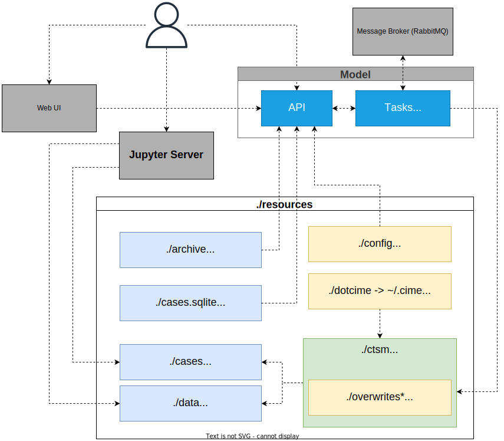

# Welcome to the documentation of the NorESM LandSites Platform

This page describes what the platform contains, how the input data were made, the main functionalities, and model output. See the navigation panel on the left for our [user guide](https://noresmhub.github.io/NorESM_LandSites_Platform/user_guide), [available sites](https://noresmhub.github.io/NorESM_LandSites_Platform/land-sites/), [about us](https://noresmhub.github.io/NorESM_LandSites_Platform/about/), and [contribution guidelines and Code of Conduct](https://noresmhub.github.io/NorESM_LandSites_Platform/contributing/). Advanced users may also be interested in the technical documentation of [FATES](https://fates-docs.readthedocs.io/en/stable/) and [CLM](https://escomp.github.io/ctsm-docs/versions/release-clm5.0/html/users_guide/index.html).

The main code is stored [here](https://github.com/NorESMhub/NorESM_LandSites_Platform) in a [GitHub repository](https://en.wikipedia.org/wiki/Git "a place to store code with version control"). The `main` branch stores the latest functioning version. Older versions can be accessed under [Releases](https://github.com/NorESMhub/NorESM_LandSites_Platform/releases). This documentation page is made with GitHub pages (`gh-pages` branch) and [Mkdocs](https://www.mkdocs.org/). To contribute to the code or documentation, see our [Contributing](https://noresmhub.github.io/NorESM_LandSites_Platform/contributing/) instructions. There you will also find our [Code of Conduct](https://noresmhub.github.io/NorESM_LandSites_Platform/contributing/#code-of-conduct).

Advanced users who want to do development in addition to just running simulations can request resources on e.g. [NREC](https://nrec.no/ "Norwegian Research and Education Cloud: Fast, standardized servers and storage for the Norwegian higher education sector"). An early version of the platform is also available on [Galaxy](https://training.galaxyproject.org/training-material/topics/climate/tutorials/fates/tutorial.html "an open, web-based platform for accessible, reproducible, and transparent computational biological research").

Please let us know if you have suggestions or trouble using the platform by opening a new [issue](https://github.com/NorESMhub/NorESM_LandSites_Platform/issues) on GitHub.

🚧 NB! This documentation is under construction and contains some outdated and/or missing parts. 🚧

*****************************

## Platform content

You can use the platform to run [single-cell model simulations](https://en.wikipedia.org/wiki/Climate_model#/media/File:Global_Climate_Model.png "the world is divided into a 3-dimensional grid, where equations can be solved within each gridcell, and information passed between gridcells at certain time points. Single-cell model 'runs' only simulate model processes for a single gridcell, which takes a lot less computational power") from a browser on your local computer. We provide [sites](https://noresmhub.github.io/NorESM_LandSites_Platform/land-sites/) with high quality input data (atmospheric forcing, land surface data, 'spin-up'), and provide Jupyter notebooks with example python code to plot some input data and model output.

*Illustration of the software architecture.
Gray boxes are Docker containers. `Model` container is expanded to show the two services running in there (i.e. `API` and `Tasks`) in addition to hosting the model and its dependencies.
`./resources` contains all the folders that are mounted into the containers by `docker-compose`.
The model and the API manage the blue ones, and yellow folders are created by the code maintainers—an asterisk indicates the folder is optional. After [first-time installation and setup](https://noresmhub.github.io/NorESM_LandSites_Platform/user_guide/#0-prerequisites-first-time-setup), users can access the Web User Interface (UI) and Jupyter server. The UI uses and Application Programming Interface (API) to send commands between the users and Docker containers.*

### API

An Application Programming Interface (API) is a set of tools that enables the end-users to interact with a program. The interaction happens by receiving some commands from the users, performing some actions if necessary, and then sending back some results. We created an HTTP API for the model using FastAPI, a popular high-performance framework for Python. It means the API can be used through any medium that can send and receive HTTP requests, e.g., browsers and libraries like python-requests. FastAPI generates a REST API based on [OpenAPI specifications](https://github.com/OAI/OpenAPI-Specification). It also automatically generates documentation for the API from the docstrings of the python functions, which includes a description of the inputs and outputs and examples. The documentation is interactive and can be accessed through its web-based user interface.

The Platform API is responsible for:

- Getting a copy of the model code (via version control or by downloading the source code).
- Setting up the model's external components.
- Overwriting parts of the model with the specified code in `resources/overwrites` (optional).
- Defining the machine config, i.e., the Docker container, for the model (see `resources/dotcime`).
- Creating, configuring, and running cases.
- Serving inputs and outputs of the created cases.

The API code can be found at [https://github.com/NorESMhub/ctsm-api](https://github.com/NorESMhub/ctsm-api).

### Docker containers and model dependencies

CTSM and NorESM depend on many external libraries, which can be challenging to install on a personal computer. The difficulties can be due to a lack of cross-platform support, version conflict with existing libraries, or system architecture.

One solution to this is containerization, which is the process of packaging and distributing software in a way that can be run on various platforms. Containers use Operating System-level virtualization. This allows efficient use of resources while isolating the software from other processes running on the host system. All the requirements for packaged software are included in the container. We used [Docker](https://www.docker.com/) for this purpose. Docker is a widely used and popular containerization tool. 

The packaged software is called an Image. When a Docker Image is run, it is called a Container, i.e., a running instance of the software. The main Image created for the Platform is [ctsm-api](https://github.com/NorESMhub/ctsm-api/pkgs/container/ctsm-api). It contains all the dependencies for the model, the scripts to initialize and configure the model, and the API code that provides access to the model. The Image can be configured via an environment file (`.env`), which gives control to users to adjust some initial properties of the model and the Platform, e.g., what version of the model to use and what drivers should be enabled.

In order to allow easier maintenance and better use of resources, some dependencies are not included in the Image. For example, the message queuing broker (RabbitMQ) required by the API, which is needed to manage asynchronous communications between the model and the API, is not included. This service can be added by using the official [RabbitMQ Docker Image](https://hub.docker.com/_/rabbitmq). Keeping this service out of the Image lets more savvy users pick a different message broker for their use cases.

To address the needs of non-technical users, we have taken care of the extra configurations for the containers by using an orchestration tool called [Docker Compose](https://docs.docker.com/compose/overview/). Docker Compose is a wrapper around Docker, which allows configuring and organizing all the containers in a single `YAML` file.

In addition to the previously mentioned Images, we have included an Image for Jupyter Server and one for our Web User Interface (UI) for `ctsm-api`.

The reason for using a container is that the NorESM model code is not an app but rather a collection of code, and that code needs to be modified in order to run on a new machine. To make the model more like a downloadable app for any machine (e.g. your mac/windows/linux laptop/pc), we put the code in a Docker container that works as a mini-machine within your machine (laptop/pc). A [Docker file](https://docs.docker.com/get-started/overview/ "a text document that contains all the commands a user could call on the command line to assemble an image") is used to enable simulations on any machine, such as a laptop or an HPC cluster. When we release a new version, we have to build a container using this Docker file. Users can then download the dontainer and run simulations there. For details on the docker file and how to modify or update it, look to [this description on GitHub](https://github.com/NorESMhub/NorESM_LandSites_Platform/tree/main/docs/docker.md)

### Web User Interface

Users can set up cases, change some model settings, and run simulations via the Web User Interface. Once the platform is correctly up and running, the UI will be available at [localhost:8080](localhost:8080). The web UI is an application that represents some configurable parameters of the model in a user-friendly way. It comes with built-in validations and error handling for the acceptable values of the parameters. Its goal is to streamline the process of editing a case and help users focus on the scientific aspects of their simulations rather than on the technical configuration.

The Web User Interface (UI) code can be found at [https://github.com/NorESMhub/fates-platform](https://github.com/NorESMhub/fates-platform). The UI is created using [Typescript](https://www.typescriptlang.org/), a superset of JavaScript language, with the [React](https://reactjs.org/) framework.

### Jupyter Server

The included Jupyter Server Image comes with some commonly used python libraries for data analysis. The list of bundled libraries is available at https://github.com/MetOs-UiO/fates_platform_ecological_climatology/blob/main/docker/jupyter/Dockerfile#L7.

When the platform is up and running, the Jupyter server is available at [localhost:8888](localhost:8888). Example and tutorial Jupyter notebooks are stored in  `/notebooks`. 

### Model versions

The platform is built to run the land model (CLM) with the Norwegian Earth System Model (as opposed to e.g. CESM which also uses the same land model). The versions of FATES and CLM therefore have to be in line with stable NorESM versions. NorESM is taken in to the platform using the `noresm_landsites` branch in the [NorESMhub/NorESM repository](https://github.com/NorESMhub/NorESM/tree/noresm_landsites). 

*Table 1: Model versions*

| Model | Version |
| --- | --- |
| NorESM | https://github.com/NorESMhub/NorESM/tree/release-nlp0.1.0 |
| CLM | [ctsm5.1.dev038](https://github.com/ESCOMP/CTSM/tree/ctsm5.1.dev038) |
| FATES | sci.1.43.2_api.14.2.0 |

### Input data

Running the model requires specifying compsets, atmospheric forcing, land surface parameters, and sometimes spin-up to get realistic simulations. 

The versioned input data are [in a shared folder on sigma2.no](https://ns2806k.webs.sigma2.no/EMERALD/EMERALD_platform/inputdata_fates_platform/). The .tar files are compressed and can be opened as a folder with e.g. 7-zip by right-clicking and choosing 'open archive', and used after extracting (unzipping). The data files are stored in [.nc (NetCDF)](https://www.unidata.ucar.edu/software/netcdf/) format, which can be viewed using [Panoply](https://www.giss.nasa.gov/tools/panoply/), or packages in Python or [R](https://cran.r-project.org/web/packages/ncdf4/index.html). The output data from simulations are stored in the same format but in the specific case folder.

#### Component sets (compsets)

Short for component sets, compsets specify which component models are used as well as specific settings for forcing scenarios and physics options. NorESM consists of several sub-models (components) for the atmosphere, land, ocean, etc, plus some common infrastructure code that allows the components to pass information back and forth at certain time steps. Component sets have a short name and a longer name with abbreviations denoting the components included. See more in the [CLM user guide](https://escomp.github.io/ctsm-docs/versions/release-clm5.0/html/users_guide/setting-up-and-running-a-case/choosing-a-compset.html).

The compset is specified by combining components in this order: atm, lnd, ice, ocn, river, glc, and wave. Each component model version may be "active," "data," "dead," or "stub". Stub components are used instead of active to save computation time and input requirements when that component is not needed for the model configuration. For instance, the active land component forced with atmospheric data, does not need ice, ocn, or glc components to be active and can replace them with stubs. 

- TIME: Initialization Time, here for the year 2000 which gives present day conditions (as opposed to pre-industrial or future) of e.g. CO2 ppm.
- ATM: Atmosphere, here DATM%1PTGSWP3 for data driven (D) atmosphere (ATM) component driven in a point (PT) by [GSWP3](https://www.isimip.org/gettingstarted/input-data-bias-correction/details/4/) forcing data
- LND: Land, here CLM50%FATES/BGC/SP for active Community Land Model version 5.0 and one of the following vegetation modes:
    1. Functionally Assembled Terrestrial Ecosystem Simulator vegetation (FATES)
    2. FATES with BioGeoChemistry (BGC)
    3. FATES simplified mode with Satellite Phenology (SP)
- ICE: Sea-ice, here SICE stub ice
- OCN: Ocean, here SOCN stub ocean
- ROF: River runoff, here MOSART the MOdel for Scale Adaptive River Transport
- GLC: Land Ice, here SGLC stub glacier (land ice) component
- WAV: Wave, here SWAV stub wave component 

The compset longname defines it in the code with the following notation: `TIME_ATM[%phys]\_LND[%phys]\_ICE[%phys]\_OCN[%phys]\_ROF[%phys]\_GLC[%phys]\_WAV[%phys]`. Currently, we only support the following compset using FATES:

>2000_DATM%1PTGSWP3_CLM50%FATES_SICE_SOCN_MOSART_SGLC_SWAV

More compsets for pre-industrial or future simulations require additional input data and may be included in future versions of the platform. For now, if you need other compsets you need to dig deeper into the CLM technical documentation and provide the necessary input data and code changes yourself. 

#### Atmospheric forcing

Atmospheric forcing data drives the modelled climate using a time series of climatic variables. Downloadable data products exist, but is often on too coarse scales for realistic single-point simulations. Here is a list of atmospheric forcing variables used in CLM:

- Incident solar radiation (FSDS), 	W/m2
- Temperature at the lowest atmospheric level (TBOT), degrees K (or can be C)
- Precipitation (PRECTmms), mm/s
- Wind speed at the lowest atmospheric level (WIND), m/s

Forcing data for our sites are stored with the rest of the [input data](https://ns2806k.webs.sigma2.no/EMERALD/EMERALD_platform/inputdata_fates_platform/). Here are some exaples of what the input data .tar contains: 

- CAM/chem/trop_mozart_aero/aero/
    - aerosol deposition: dust, black carbon, organic carbon
- datm7
    - GSWP3v1: monthly atmospheric forcing from the [GSWP3](https://www.isimip.org/gettingstarted/input-data-bias-correction/details/4/) data product. The climatic variables in the above list are stored in these files.
    - NASA_LIS: lightning frequency
    - topo_forcing: topography height

If you have your own data, you can replace the default input files with your own. *under construction: Instruction for how to do this*. Make sure the format and units are the exact same, otherwise the model will not be able to use them. For more information on using custom input to CLM, see the [CLM documentation](https://www.cesm.ucar.edu/models/cesm1.0/clm/models/lnd/clm/doc/UsersGuide/x9798.html)

#### Surface data

Surface data contains information the model needs about the land surface, such as land use trajectories, soil properties, vegetation parameters, and [albedo](https://en.wikipedia.org/wiki/Albedo). Here are some exaples of what the input data .tar contains: 

- 'firedata'
    - population density 
- 'paramdata'
    - CLM5 parameters: many parameters, covering e.g. Plant Functional Types (PFTs), allocation of carbon, photosynthetic pathway
    - FATES parameters: many parameters, covering e.g. Plant Functional Types (PFTs), allometry, carbon pools, nitrogen uptake, mortality, recruitment, fuel load for fire module 
- 'snicardata'
    - snow "growth" parameters
    - snow "optics"
- 'surfdata_map'
    - surface data:  soil depth & other properties, albedo & thermal conductance of different surface types, and fraction of gridcell covered by vegetation, land, & other land cover types
- 'urbandata'
    - urban classes, building interior temperature

Note that when CLM is running without FATES, a simpler 'big-leaf'-version of vegetation is used instead. The CLM5 and FATES parameters thus overlap to some degree, with FATES replacing some and adding other parameters when activated. 

For the [Vestland climate grid sites](https://noresmhub.github.io/NorESM_LandSites_Platform/land-sites/), surface data has been created from raw data sets, using [this script](https://github.com/huitang-earth/NLP_prep/blob/main/create_inputdata.sh "a script in Hui's repository for preparing input data"). There are publicly available data products that could be downloaded and extracted for the nearest model gridcell, given points coordinates, that contain all the necessary surface data. We have not used this; our surface data is interpolated from raw data sets of better resolution. This data should be more accurate than the alternative data products. 

If you have your own data, you can replace the default input files with your own. ***under construction: Instruction for how to do this***. Make sure the format and units are the same, otherwise the model will not be able to use them. 

For more information on using custom input to CLM, see the [CLM documentation](https://www.cesm.ucar.edu/models/cesm1.0/clm/models/lnd/clm/doc/UsersGuide/x9798.html)

#### Spin-up

To get realistic simulations, the model needs to run for a while to reach a state of equilibrium under the applied forcing. Starting the model from "bare ground" (= run type startup), the model needs time to grow and kill vegetation to get appropriate soil properties, Plant Functional Type distribution, and a stable climate. 

**************************************

## Model parameters and sites configuration

To be able to set model parameters in the web UI, some configuration files are needed. Both model parameters and sites configurations are provided by the maintainers as JSON files in `resources/config/variables_config.json` and `resources/config/sites.json`. They can be modified by users who are familiar with the model. 

The model parameters file contains a list of JSON objects. Attributes of each object are described in table [TODO: X2]. Note that not all types of variables accepted by the model are supported in the user interface at this point.

The tables below describe how these configuration files work and handle the model settings users can change in the UI.

*Table 2: Model parameter attributes, compare to the [variables_config.json](https://github.com/NorESMhub/NorESM_LandSites_Platform/blob/main/resources/config/variables_config.json) file in `/resources/config`*

| Attribute         | Type                            | default | Required | Scope      | Description                                                                                                                                              |
|-------------------|---------------------------------|---------|----------|------------|----------------------------------------------------------------------------------------------------------------------------------------------------------|
| name              | string                          | -       | yes      | Model      | Name of the variable exactly as it should be passed to the model.                                                                                        |
| label             | string                          | -       | no       | UI         | A human-readable label describing the parameter.                                                                                                         |
| category          | string                          | -       | yes      | API        | One of the following: `ctsm_xml`, `user_nl_clm`, `user_nl_clm_history_file`, `fates`, `fates_param`.                                                     |
| type              | string                          | -       | yes      | Model, API | One of the following: `char`, `integer`, `float`, `logical`, `date`.                                                                                     |
| description       | string                          | -       | no       | UI         | Detailed description of the parameter.                                                                                                                   |
| readonly          | boolean                         | false   | no       | UI         | Whether the parameter can be edited by the user.                                                                                                         |
| hidden            | boolean                         | false   | no       | UI         | Whether the parameter should be hidden from the user.                                                                                                    |
| allow_multiple    | boolean                         | false   | no       | API, UI    | Whether the parameter accepts multiple values.                                                                                                           |
| allow_custom      | boolean                         | false   | no       | UI         | Whether users can enter values other than the ones provided as choices (only applies to those parameters with `choices` in their `validation` attribute. |
| validation        | Validation object               | -       | no       | API, UI    | See `Validation` table below ([TODO: X3]).                                                                                                               |
| default           | integer, float, string, boolean | -       | no       | API        | A default value to use. It must match the type specified by the `type` attribute. If `allow_multiple` is set to `true`, it must be a list of values.     |
| placeholder       | string                          | -       | no       | UI         | A placeholder value to show to the user. This value is not actually applied if no value is entered by the user.                                          |
| append_input_path | boolean                         | false   | no       | API        | Whether to adjust a path value based on its relative location in the input folder.                                                                       |

Adjusted values can be validated using the `validation` attribute. Currently, only the validators described in table 3 are supported.

*Table 3: validation attributes to define which values are accepted for each model parameter*

| Attribute     | Type                              | Description                                                             |
|---------------|-----------------------------------|-------------------------------------------------------------------------|
| min           | float                             | A minimum value for numeric attributes.                                 |
| max           | float                             | A maximum value for numeric attributes.                                 |
| pattern       | string                            | A regular expression to match the value against.                        |
| pattern_error | string                            | A custom error message for values not matching the `pattern` attribute. |
| choices       | [integer, float, string, boolean] | A list of choices for users to select from.                             |

Sites in `resources/config/sites.json` are described as [GeoJSON points](https://datatracker.ietf.org/doc/html/rfc7946#section-3.1.2). The site map in the web UI draws on these site definitions. Their configuration is set in the `properties` attribute of the GeoJSON object, as described in table 4.

*Table 4: Site geoJSON properties, compare with the [sites.json](https://github.com/NorESMhub/NorESM_LandSites_Platform/blob/main/resources/config/sites.json) file in `/resources/config`*

| Attribute | Type            | Required | Description                                                                                                                                                                                                                                                                       |
|-----------|-----------------|----------|-----------------------------------------------------------------------------------------------------------------------------------------------------------------------------------------------------------------------------------------------------------------------------------|
| name      | string          | yes      | Name of the site.                                                                                                                                                                                                                                                                 |
| compset   | string          | yes      | The component set to use with the model.                                                                                                                                                                                                                                          |
| res       | string          | yes      | The resolution/grid to use with the model.                                                                                                                                                                                                                                        |
| config    | [Config object] | no       | Config is an object with two keys: `name` and `value`. The former must point to a parameter in `resources/config/variables_config.json`. The latter must be a valid value for that parameters. These are used as default values for the given parameter for the site. |

**************************************

## Running simulations in the web User Interface

See the [user guide](https://noresmhub.github.io/NorESM_LandSites_Platform/user_guide) for instructions on running simulations. Advanced users who want to change additional or different model parameters or settings can do so manually 

### Create case

To run a simulation, you need to set up a [case](https://esmci.github.io/cime/versions/master/html/glossary/index.html#term-case-CASE "An instance of a model simulation. A case is defined by a component set, a model grid, a machine, a compiler, and any other additional customizations.") which tells the model how to run. A case can be run several times, or stopped and started again. For more detailed information on what goes on in CLM and its coupler (which connects CLM to other model components), see this [CIME user guide](https://esmci.github.io/cime/versions/master/html/users_guide/index.html), but note that the NorESM modelling platform uses these commands and scripts more indirectly. 

In the web UI, once you have chosen a site you get options to download site data (optional) and to create a new case. When you create a new case, you can change some model parameters as defined in the [variables_config.json](https://github.com/NorESMhub/NorESM_LandSites_Platform/blob/main/resources/config/variables_config.json) file described above. There are more customisation options for the models that advanced users can change manually, but for simplicity and explainability we have restricted the options in the UI and grouped them like this:

1. [Run environment](https://noresmhub.github.io/NorESM_LandSites_Platform/#run-environment-settings)
2. [CLM namelist](https://noresmhub.github.io/NorESM_LandSites_Platform/#clm-namelist-simulation-settings)
3. [History Files](https://noresmhub.github.io/NorESM_LandSites_Platform/#history-files)
4. [FATES](https://noresmhub.github.io/NorESM_LandSites_Platform/#fates-simulation-settings)

#### Run environment settings

| parameter | values | explanation |
| --- | --- | --- |
| CALENDAR | No Leap, Gregorian | Should the simulation follow the Gregorian (realistic) or simplified calendar without leap years? This option should normally follow the calendar the input data is provided in. |
| DATM_CLMCEP_YR_START | 
|  |  |  |
| RUN_TYPE | startup, hybrid, branch, restart | *startup*: a 'cold' start from bare ground. The vegetation and climate is not in equilibrium and the model will not produce realistic output. No spin-up included. Use this mode for quick testing, or for making your own spin-up. *hybrid*: the model is initialized similar to a startup run, but uses initialization datasets from a previous case. Suitable when you already have good spin-up files and want a more realistic simulation. *branch*: the model is initialized using a consistent set of restart files from a previous run. The case name is generally changed for a branch run, although it does not have to be. Branch runs are suitable for sensitivity or parameter studies, or when settings for history file output streams need to be modified while still maintaining bit-for-bit reproducibility. *restart*: continues running an existing case after it has been stopped. |

#### CLM namelist simulation settings

| parameter | values | explanation |
| --- | --- | --- |

#### History Files

By default, the model records output in one tape (hist_fincl1) as one (hist_mfilt=1) average (hist_avgflag_pertape=A) monthly (hist_nhtfrq=0) value, for a subset of variables (Active=T in [this list](https://escomp.github.io/ctsm-docs/versions/master/html/users_guide/setting-up-and-running-a-case/master_list_fates.html "Full list of possible CTSM History Fields with FATES"), in a long-lat grid (hist_dov2xy=TRUE). If you want output to be recorded for [additional variables](https://escomp.github.io/ctsm-docs/versions/master/html/users_guide/setting-up-and-running-a-case/master_list_fates.html "Full list of possible CTSM History Fields with FATES") or at different time steps, you can modify the first column or fill in additional columns. Each column corresponds to a history tape, that is a series of files created for the simulation period. If you want to run the model without saving any output, set hist_mfilt=0 in the first column. By modifying additional columns,  you can add tapes (series of files) with with e.g. different output variables recorded at its maximum value per day and in a long string instead of in the default lat-lon grid (some vegetation demographic output is only accessible in that format).

| parameter | values | explanation |
| --- | --- | --- |

#### FATES simulation settings

Users can remove or modify Plant Functional Types by checking/unchecking PFTs and typing in custom values for a subset of parameters. The full list of parameters is in the [FATES model code](https://github.com/NGEET/fates/blob/master/parameter_files/fates_params_default.cdl).

| parameter | values | explanation |
| --- | --- | --- |

### Running and editing simulations

Once a case had been created and is ready, you can look at the model settings is can be run and copied/edited using the Edit button.

**************************************

## Postprocess

### output files

Output is stored in [.nc (NetCDF)](https://www.unidata.ucar.edu/software/netcdf/) format, which can be viewed using Panoply, or packages in Python or [R](https://cran.r-project.org/web/packages/ncdf4/index.html). From the UI, when a case has finished successfully you can download the output or simply open the Jupyter server (at localhost:8888) and work with the output there, using e.g. the provided notebook in the tutorials folder.

**************************************

## Versions

Platform versions follow standard numbering, and releases below 1 should be considered unstable and preliminary. 

#### List of versions (newest on top):

- [release ...]()
- [tag 0.1.0-dev]()
