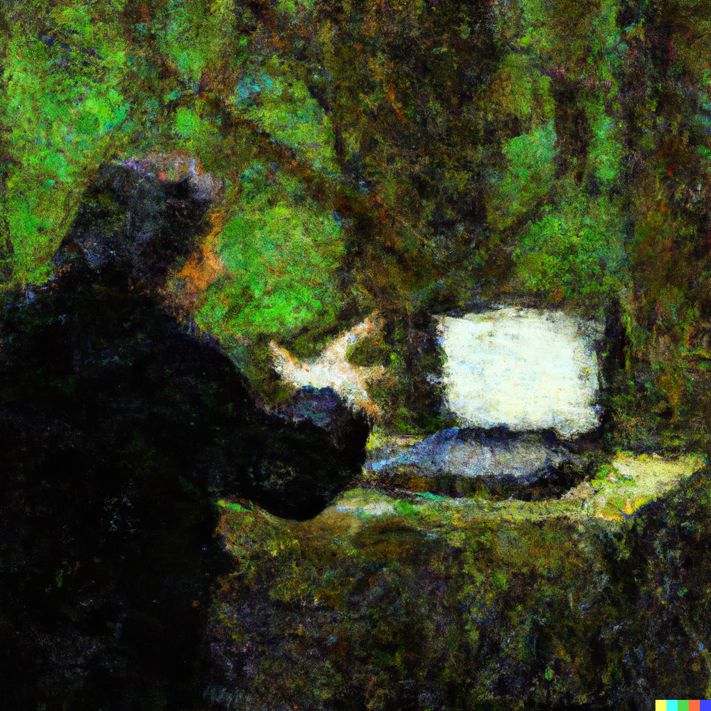
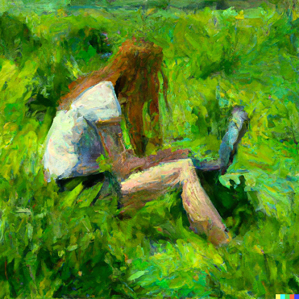

# Welcome to the NorESM Land Sites Platform

- [User guide](https://noresmhub.github.io/noresm-land-sites-platform/user_guide)
- [Technical documentation](https://noresmhub.github.io/noresm-land-sites-platform/documentation)
- [Sites](https://noresmhub.github.io/noresm-land-sites-platform/land-sites)
- [About us](https://noresmhub.github.io/noresm-land-sites-platform/about)
- [Contributing and Code of Conduct](https://noresmhub.github.io/noresm-land-sites-platform/contributing)

The NorESM-LSP software allows anyone to run simple, offline, single-site simulations with the demographic dynamic global vegetation model [NorESM](https://github.com/NorESMhub/NorESM)-[CLM](https://github.com/ESCOMP/CTSM)-[FATES](https://github.com/NGEET/fates). Our aim is to improve access to this process-based modelling framework. The software is free and open, and might be used ...

1. In education, such as interdisciplinary workshops or data labs in Ecological Climatology-related university courses, where model experiments will typically be simple and designed to increase understanding of the model framework and Earth System Science.
2. By beginner modelers, e.g. post-graduate students or scientists who are new to CLM-FATES modelling, to set up scientific model experiments under the supervision of or in collaboration with more experienced modelers. 
3. By experienced modelers without access to HPC clusters with the models installed, who benefit from the containerisation of the model.

*Model experiments with CLM-FATES simulate potential vegetation. What ecosystem would appear where you are right now, in the absence of human land use?*
