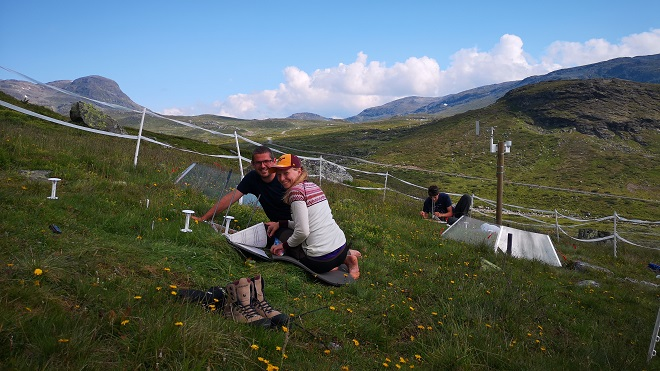

# NorESM land sites

NorESM-LSP simulations are at the site level, also called single-point or single-(grid-)cell simulations.

You have two options:

1. Choose an integrated site where we have preprocessed all the necessary data, or
2. Create a custom site by uploading a zipped data file with input data and site coordinates, created with the [`subset_data` script](https://github.com/ESCOMP/CTSM/blob/master/python/ctsm/subset_data.py) developed at NCAR for the land model. If you have access to a supercomputer you can follow existing tutorials, e.g.  the [land model single-point tutorial](https://github.com/NCAR/CTSM-Tutorial-2022/blob/main/notebooks/Day2a_GenericSinglePoint.ipynb) or the [NorESM single-point tutorial](https://metos-uio.github.io/CTSM-Norway-Documentation/quick-start-single-point/).

## 1. Integrated sites

To run simulations, it's necessary to subset large, global data files that are inconvenient or impossible to download on a laptop. We therefore offer a set of integrated sites so it's easy to get started with modelling. Creating your own site can be challenging for beginners and requires supercomputer access. It is also possible to download the input data for an existing site and modify it in e.g. JupyterLab or R, but do this at your own risk. It is also possible to request for new sites to be integrated in the platform, but this requires some manual work and we cannot promise to prioritise this. 

Note that the default data for the sites are subset by matching site coordinates with a gridcell in the data set. The coordinates could be in the center or periphery of that gridcell. The default data are also quite coarse in resolution, which means that when the landscape around the site is not flat and uniform, the data values may be unrepresentative for the site. The value will instead represent the average of the whole gridcell, which may include deep valleys and tall peaks and everything in between. Keep this in mind when interpreting the results of your simulations. 

We currently support 20 sites that we group according to projects: 

- [8 climate station sites](https://noresmhub.github.io/noresm-land-sites-platform/land-sites/#latice-mip-sites) of interest to the [LATICE](https://www.mn.uio.no/geo/english/research/groups/latice/) group 
- and the [12 Vestland climate grid sites](https://noresmhub.github.io/noresm-land-sites-platform/land-sites/#vestland-climate-grid-sites). 
 
These locations are established study sites with climatic, and/or ecological data available. Each group of sites have similar data and are easier to compare, whereas sites from different groups might have different kinds of data. Detailed site descriptions and links to data providers are listed below for each group. NB! Note that the data from the sources we link to here may be subject to terms specified in the individual data papers and repositories, such as usage statements requiring authorship or acknowledgement. Check these terms before publishing any data (e.g in papers, theses, or public presentations)!

<link rel="stylesheet" href="https://unpkg.com/leaflet@1.7.1/dist/leaflet.css"
   integrity="sha512-xodZBNTC5n17Xt2atTPuE1HxjVMSvLVW9ocqUKLsCC5CXdbqCmblAshOMAS6/keqq/sMZMZ19scR4PsZChSR7A=="
   crossorigin=""/>
<link rel="stylesheet" href="https://cdnjs.cloudflare.com/ajax/libs/font-awesome/4.7.0/css/font-awesome.min.css">

   

You can use the [site GEOJSON file](https://github.com/NorESMhub/noresm-land-sites-platform/blob/main/resources/config/sites.json) to conveniently create custom maps. [Here](https://github.com/evalieungh/map_scripts) is an example to plot site locations with a background map in R.

-----------------------------------------------------------------------

### LATICE-MIP sites

LATICE-MIP is a coordinated effort to utilise field measurements at different sites for land surface modelling activities in Norway. Currently, eight sites provide flux tower and surface data representing the latitudinal gradient between 60° and 78° N in Norway including Svalbard. The most prominent site is the Finse Eco-Hydrological Observatory (EcHO; http://mn.uio.no/latice/infrastructure/ [accessed 2022-06-21]) (Pirk et al. in prep), located at 1200 m above sea level. Lakes and rivers, alpine heathland, open fens, and snowbeds dominate the land surface around the observatory (Bryn and Horvath 2020). Finse has a long research history in alpine biology, glaciology, and geology, and high quality and -resolution data for solving and tracking surface energy balance, CO2, and H2O fluxes between the land and the atmosphere. Site-specific information and links to data sources are provided in the table below.

| Site name | Station name    | Lon (X)     |   Lat (Y)     |  Elevation, m (Z) | Data | Data years | Data types | Description      |
| --------- |---------------- | ----------  | -----------   | -------------- | ---- | ---------- | ---------- | ---------------- |
| FNS       | Finse_fluxtower | 7.527008533 | 60.59383774   | 1210           |      | Feb 2018 - present | Long wave in (LWin), Long wave out (LWout), Short wave in (SWin), Short wave out (SWout), turbulent heat fluxes, 10 m air temperature, air pressure, 4.4 m wind speed and direction, snow depths (surveys and single point), H2O, CO2, soil temperature, soil vol. water, soil conductivity, drone images | Above current climatic tree- and forest lines. Alpine ridges, wetlands, lakes, heather and snowbed vegetation. mn.uio.no/latice/infrastructure 
| HIS1      | Hisaasen_up     | 12.25481033 | 61.10516357   | 681            |      | June 2019 - present | Long wave in (LWin), Long wave out (LWout), Short wave in (SWin), Short wave out (SWout), turbulent heat fluxes, 2 m air temperature, air pressure, 2.8 m wind speed and direction, rain
| HIS2      | hisaasen_low    | 12.25089836 | 61.1115036    | 642            |      | "           | "
| ISK       | Iskoras_EC      | 25.29547425 | 69.3408715    | 357            | Some data in supporting information: [doi.org/10.1029/2018JF004945](https://doi.org/10.1029/2018JF004945) |  | "
| AAS       | Aas             | 10.781667   | 59.660278     | 93.2           |      |            | | Precipitation, temperature, wind, air pressure, snow depth, EC measurements | meteorological data is from MET Norway
| HUR       | Hurdal          | 11.078142   | 60.372387     | 270             |      |
| BYV       | Bayelva         | 11.83334    | 78.92094      | 56             | [https://doi.org/10.5194/essd-10-355-2018](https://doi.org/10.5194/essd-10-355-2018), see also [doi.org/10.1029/2020GL092256](https://doi.org/10.1029/2020GL092256) | 1998–2017 | permafrost, active layer and meteorological conditions | 
| ADV       | Adventdalen     | 15.91667    | 78.18333      | 21             | https://fluxnet.org/doi/FLUXNET2015/SJ-Adv  | 2011-2014 |

Other relevant papers:

- [Pirk, N., Aalstad, K., Westermann, S., Vatne, A., van Hove, A., Tallaksen, L. M., Cassiani, M., and Katul, G.: Inferring surface energy fluxes using drone data assimilation in large eddy simulations, Atmos. Meas. Tech. Discuss, in review, 2022](https://doi.org/10.5194/amt-2022-219) (Hisåsen and Iskoras data used)

*Details from the Finse flux tower. Photo from [Finse EcHO](https://www.mn.uio.no/geo/english/research/groups/latice/infrastructure/)*

-----------------------------------------------------------------------

### [Vestland climate grid](https://betweenthefjords.w.uib.no/vestland-climate-grid/) sites

The Vestland climate grid is a set of calcareous grassland sites across gradients of precipitation and temperature. The sites have been, and still are, host to many ecological reseach projects that study vegetation dynamics, plant interactions, functional traits and climate responses. Each site also has loggers for temperature and other climatic variables.

Central data papers and sources:

- [Vandvik *et al.* 2022](https://doi.org/10.1038/s41597-022-01559-0)
- [Vestland Climate Grid on OSF](https://osf.io/npfa9/)
- [FunCaB on Zenodo](https://zenodo.org/record/6520022)
- Coming soon: [INCLINE](https://www.uib.no/en/rg/EECRG/114810/incline)

| Site name | Name             | Lon (X) | Lat (Y) | Elevation (Z) | Data years | Data types | Description      |
| --------- | ---------------  | ------- | ------- | ------------- | ---------- | ---------- | ---------------- |   
| ALP1      | Ulvehaugen       | 8.12343 | 61.0243 | 1208          | 2008-2022  | Vegetation surveys, vegetation demography, experimental treatments, weather data: [to be added] | Above current climatic forest line. Semi-natural grassland, heather, ridges and snowbeds |
| ALP2      | Laavisdalen      | 7.27596 | 60.8231 | 1097          |  " | " |
| ALP3      | Gudmedalen       | 7.17561 | 60.8328 | 1213          |  " | " |
| ALP4      | Skjellingahaugen | 6.41504 | 60.9335 | 1088          |  " | " |
| SUB1      | Aalrust          | 8.70466 | 60.8203 | 815           |    |   | Just below current climatic forest line. |
| SUB2      | Hoegsete         | 7.17666 | 60.8760 | 700           |  " | " |
| SUB3      | Rambaera         | 6.63028 | 61.0866 | 769           |  " | " |
| SUB4      | Veskre           | 6.51468 | 60.5445 | 797           |  " | " |
| BOR1      | Fauske           | 9.07876 | 61.0355 | 589           |    |   | Well below current climatic forest line. |
| BOR2      | Vikesland        | 7.16982 | 60.8803 | 474           | "  | " |
| BOR3      | Arhelleren       | 6.33738 | 60.6652 | 431           | "  | " |
| BOR4      | Oevstedal        | 5.96487 | 60.6901 | 346           | "  | " |

*Figure 1: Illustration of the Vestland Climate Grid, from the SeedClim project: turf squares (top soil, roots and whole plants) were cut out and physically transplanted to other sites, as indicated by the arrows in the top left corner. The vegetation in these turfs was carefully monitored over several years in their new locations, to see how and how quickly the plants adapted to a new environment. Figure by V. Vandvik et al., betweenthefjords.w.uib.no*

*Figure 2: Field work at Ulvehaugen (ALP1) in 2019. Ragnhild Gya and Joachim Töpper doing vegetation analysis in a 25x35cm metal frame. The small, white ([Tomst](https://tomst.com/web/en/systems/tms/tms-4/)) loggers track temperature and soil moisture, and the small weather station (wooden pole to the right) tracks additional weather data. The fence keeps sheep and other animals away from the plots, but the vegetation is semi-natural after decades or centuries of grazing. The clear, hexagonal Open-Top Chambers experimentally heat up the vegetation. Photo by E. Lieungh*

## 2. Custom sites

To create a custom site, you need 

- the site coordinates, and 
- to subset global files or to modify existing ones. 

The easy way of subsetting data, using the NCAR-developed `subset_data` script and `user_mods` directory, requires huge storage space for the global files, e.g. on a supercomputer. There are tutorials for the land model and NorESM that can guide you through this: [CTSM 2022 Tutorial](https://github.com/NCAR/CTSM-Tutorial-2022/blob/main/notebooks/Day2a_GenericSinglePoint.ipynb) (tailored for the Cheyenne supercomputer) and [NorESM single point tutorial](https://metos-uio.github.io/CTSM-Norway-Documentation/quick-start-single-point/)(tailored for Fram supercomputer). 

Before you start to run simulations, compare your zipped file to the input data for one of the integrated sites to check if it has the same structure.

To run simulations at a custom site, upload the zipped input data file under the `Create case for custom site` button in the user interface (localhost:8080). There you get the same popup as the integrated sites, with options to change e.g. CO2 concentration or Plant Functional Types to include.
