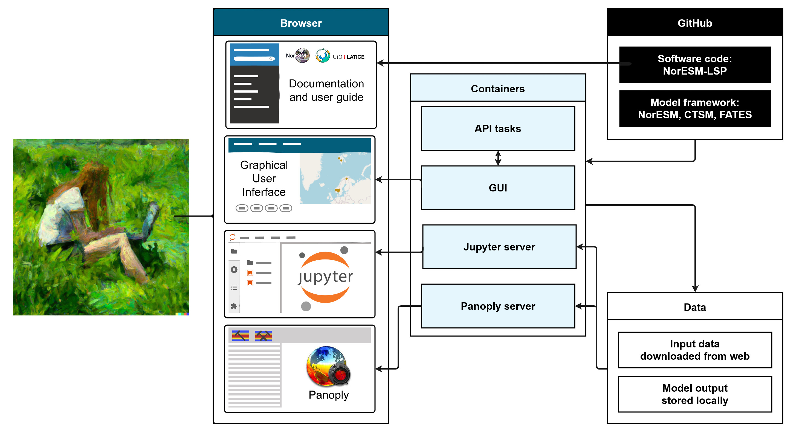
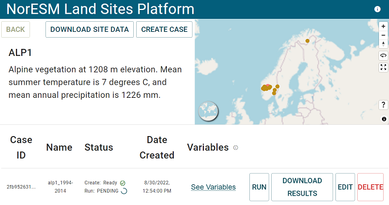
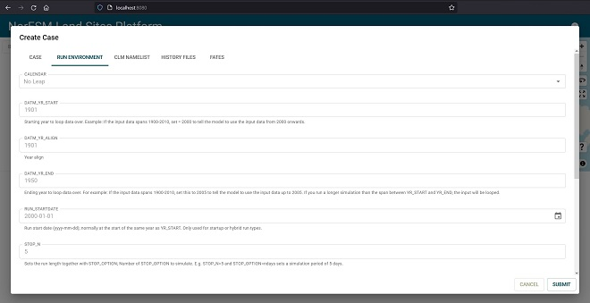

# User guide

This is the user guide for running single-site simulations with the [NorESM LandSites Platform](https://noresmhub.github.io/noresm-land-sites-platform/). It guides you through [downloading the software](https://noresmhub.github.io/noresm-land-sites-platform/user_guide/#0-prerequisites-first-time-setup) and how to [use the Graphical User Interface (GUI)](https://noresmhub.github.io/noresm-land-sites-platform/user_guide/#2-inside-gui-set-simulation-settings) and the [analysis tools in JupyterLab](https://noresmhub.github.io/noresm-land-sites-platform/user_guide/#4-look-at-your-output). More information about the LSP and the model framework is available in our [technical documentation](https://noresmhub.github.io/noresm-land-sites-platform/documentation/). If you want to learn more about the FATES, CLM, and NorESM models, we have collected some useful links to tutorials and documentation in the [external resources page](https://noresmhub.github.io/noresm-land-sites-platform/resources/).

> NB! Note that the default values and input data we provide are sufficient for educational uses, but should not be considered high-quality model experiments. If your goal is to set up high-quality model experiments, you might want to modify or provide your own input data, and set up long spin-up simulations to reach a steady-state. Note also that the site-specific data downloaded from external sources may have terms and conditions of use, so make sure to read and follow those terms if you plan to publish your model experiment! 

***********************************************

## TL;DR quick start 🏃‍♀️🏃‍♂️

If you have already completed [first-time setup](https://noresmhub.github.io/noresm-land-sites-platform/user_guide/#0-prerequisites-first-time-setup) and know what you are doing, here is the extremely quick user guide. In a terminal where you have the repository: 
    
```
cd noresm-land-sites-platform
docker-compose up
```

Open the GUI: [localhost:8080](http://localhost:8080) and push buttons, and access jypyter notebooks on [localhost:8888](http://localhost:8888) and Panoply on [localhost:5800](http://localhost:5800) 🎉

***********************************************

## An overview of the LSP software



*Illustration of the user interfaces and a simplified software architecture. From your browser, you can access this user guide and our technical documentation, as well as the GUI, JupyterLab and Panoply servers once the containers are up and running (see [0. Prerequisites](https://noresmhub.github.io/noresm-land-sites-platform/user_guide/#0-prerequisites-first-time-setup) and [1. Starting the containers](https://noresmhub.github.io/noresm-land-sites-platform/user_guide/#1-start-the-container) below). Containers provide virtual computing environments where we can run the model and the software can communicate with each other. Repositories (versioned file structures) with the code for the NorESM-LSP and models are stored on GitHub. Input data is downloaded to the containers from external storage, and model output is stored locally in the user's copy of the repository. See the [Software Architecture description in the technical documentation](https://noresmhub.github.io/noresm-land-sites-platform/documentation/#software-architecture) for more details.*

## Step by step guide for using the platform

> Check out our [glossary of technical terms](https://noresmhub.github.io/noresm-land-sites-platform/documentation/#glossary-of-technical-terms).

> If you want to use the LSP on a remote computer, see the [SSH tunnel instructions](https://noresmhub.github.io/noresm-land-sites-platform/documentation/#ssh-tunneling-with-example-for-nrec).

### 0. Prerequisites (first time setup) 🌱

To use the NorESM land sites platform, you need [Git](https://git-scm.com/downloads "click the pc screen button if you are on Windows") and [Docker desktop](https://www.docker.com/products/docker-desktop) before you can clone the [repository](https://github.com/NorESMhub/noresm-land-sites-platform "repository for the NorESM Land Sites platform") (= download the code) and start working in the containers. You may need administrator rights to your computer to install Git and Docker.  If you don't want to use Git, you can try to download and unpack the repository manually instead by clicking the `code` button and `download zip`. Step by step (with steps in brackets only sometimes necessary, depending on your computer):

1. [Create a GitHub account](https://github.com/) (optional, but generally recommended to be able to open issues, etc.)
2. Install Git on your machine. For Windows: https://gitforwindows.org/, other: https://github.com/git-guides/install-git
3. Install [Docker desktop](https://docs.docker.com/get-docker), might require restart
4. (Install Docker Compose; should already be included in the Docker installation described above for Mac and Windows: [install docker-compose](https://docs.docker.com/compose/install) )
5. (Remarks for Windows: You may have to install WSL2 (the 'two' is important here) manually if prompted. Follow the steps described [here](https://www.omgubuntu.co.uk/how-to-install-wsl2-on-windows-10). To open the Windows Command Prompt terminal as an administrator, type `cmd` into the Windows search bar located next to the Start Symbol (lower-left corner of the screen), right-click on 'Command Prompt', and select 'Run as administrator'. Also, note that some steps in the guide are executed in the 'Command Prompt' and some are executed in the 'Windows PowerShell'; to open the latter, type 'PowerShell' into the search bar and open as administrator. If Docker complains about you not belonging to the correct 'user group' after successful installation, follow the steps described [here](https://stackoverflow.com/questions/61530874/docker-how-do-i-add-myself-to-the-docker-users-group-on-windows-10-home))
6. Open the file explorer and find a suitable folder to serve as working directory. This is where you will store the repository and installation files needed by the platform, as well as your output files (which may take up quite a bit of space!). Your working directory should be easy to find, stable, and have plenty of free space available. For instance `C:/Users/yourusername` (OneDrive, USB sticks, or your overly-cluttered desktop are not recommended 👀).
7. When you are in your chosen working directory, right-click and choose "Git Bash here" (Windows). You can also directly use `cd [path_to_working_directory]` in a terminal with Git installed. Copy and paste the following line into the terminal (note that in some terminals such as Git Bash, you need to click the right mouse button to paste from the clipboard):

```
git clone https://github.com/NorESMhub/noresm-land-sites-platform.git --config core.autocrlf=

```

This will download (= clone) the repository (= folder structure of files with version history) to your working directory. You can now see the folder and files in your file explorer.

Once Git, Docker Desktop and the repository are in place, you don't have to do this again. 

### 1. Start the container 🧰

In the working directory where you have cloned the repository, open a terminal (e.g. by right-clicking and choosing "Git Bash here"; or use the one you already have open if you just did the first-time setup). Then write these commands (hit enter after each line) to get the container up and running:

```
cd noresm-land-sites-platform
docker-compose up
```

> If you get an error, make sure you are inside the folder containing the `docker-compose.yaml` file. Type `ls` and hit enter to list the files in the current folder. You can *c*hange *d*irectories by typing `cd foldername` to get inside foldername, and `cd ..` to move up to the parent folder. Tip! Press Tab to autocomplete a folder or file name after typing the first letter(s).

The first time you execute this command, a lot of files will be downloaded. This might take half an hour or so depending on your internet connection. After this initial download, it will be much faster (<1min). Once the terminal messages stop, you can access the user interface by going to this address in a new browser tab: [localhost:8080](http://localhost:8080). 

### 2. Inside GUI: Set simulation settings ⚙️

In the graphical user interface (= GUI) at [localhost:8080](http://localhost:8080) you can easily set up and run model experiments. This interface has access to the Docker containers you started in step 1, and communicates with the models via the [API](https://noresmhub.github.io/noresm-land-sites-platform/#api). 

In the GUI, you will see a list and map of integrated sites, as well as a list of your cases (model experiments) once you create some. You can also [run a simulation for a new site with your own input data](https://noresmhub.github.io/noresm-land-sites-platform/land-sites/). If you are doing a quick test with default settings, just pick a site and click `create case`, `submit` and then `run`. A default test case of 1 year should take ~10-20 mins. The GUI should look like this once you have chosen a site and have submitted and started to run a case:



*Figure 1: Screenshot from the GUI with a case created for the ALP1 site. Edited for readability.*

#### 2.1 Choose a [site](https://noresmhub.github.io/noresm-land-sites-platform/land-sites/) 

...by clicking either a button or a point on the map! Or [add a new site with your own data](https://noresmhub.github.io/noresm-land-sites-platform/land-sites/).

#### 2.2 Download site data button (optional)

For the integrated sites, the input data the models need is already available in the container. With the `download site data` button you can download it to somewhere else if you wish. We provide notebooks under `/notebooks/plot_input_data/` that you can open in Jupyterlab on [localhost:8888](localhost:8888) to familiarize yourself with some of the data that goes into a simulation, or as inspiration for making your own plots if you provided your own, improved input data. This is a good thing to do while your case is running.

#### 2.3 Create case

With the `create case` button, you can look at and edit some model settings and parameters as you create a new case. To run a simulation, you need to set up a [case](https://esmci.github.io/cime/versions/master/html/glossary/index.html#term-case-CASE "An instance of a model simulation. A case is defined by a component set, a model grid, a machine, a compiler, and any other additional customizations.") which tells the model how to run. For more detailed information on what goes on in CLM and its coupler (which connects CLM to other model components), see this [CIME user guide](https://esmci.github.io/cime/versions/master/html/users_guide/index.html), but note that the NorESM modelling platform uses these commands and scripts more indirectly through the GUI and API. When you add a new site, the data upload and `create case` popup is combined.

Once you have chosen a site, you get options to download site data (optional) and to create a new case. When you create a new case, you can change some model parameters as described below. Note that there are five tabs with different types of case and model settings, grouped into Case, Run Environment, CLM namelist, History fields, and FATES settings. This is not an exhaustive list of possible changes (by far), but give you easy access to some options in the different tabs. Under CLM Namelist settings, there is an Advanced box were experienced users can customise the [CLM namelist](https://escomp.github.io/ctsm-docs/versions/master/html/users_guide/setting-up-and-running-a-case/customizing-the-clm-namelist.html) with code, e.g. `[parameter]=[newvalue]`. All the boxes have default values for a quick but not especially realistic simulation.

Note that you generally just need to touch four of the `Run environment` settings: STOP_N and STOP_OPTION to set the simulation length, and DATM_YR_START and DATM_YR_END to specify which years to use data from. If you change the starting year (DATM_YR_START), it's often best to change RUN_STARTDATE to the start of the same year. 



*Screenshot of the pop-up triggered with the Create Case button. Notice the different tabs that give you access to different settings: case, run environment controlling simulation time, CLM namelist settings, history files controlling output files, and FATES parameters.*

|| Case settings   |
|-|----------------|
|Case name| Free text. Specify a name for your case. This will be combined with a unique ID number generated randomly. Good case names say something about e.g. site, settings, or simulation period. For example: ALP1-10yr-default, ADV-1000yr-400ppm, FNS-200yr-notreepft|
|Driver name | Dropdown. ['nuopc'](https://earthsystemmodeling.org/nuopc/) by default since 2021|

|| Run environment |
|-|----------------|
|Calendar | Read-only. Calendar can be No-leap or Gregorian. Some input data (like our default GSWP3 data set) omits leap years because they complicate long simulations where input data is 'looped' (recycled) several times. Gregorian is the 'normal' calendar including leap years.|
| DATM_YR_START | Integer (year). Starting year to loop data over. Example: If the input data spans 1900-2014, set = 2000 to tell the model to use the input data from 2000 onwards.|
| DATM_YR_ALIGN | Integer (year). Used to align the simulation year with the forcing data set. It specifies the simulation year corresponding to DATM_YR_START. For example, setting DATM_YR_ALIGN=DATM_YR_START means that the forcing calendar will be the same as the model calendar: the forcing for a given model year would be the forcing of the same year. This is appropriate when the model calendar is set up to span the same year range as the forcing data. By setting it to the same year as RUN_STARTDATE (below), the forcing in the first year of the run will be the forcing of year DATM_YR_START.|
| DATM_YR_END | Integer (year). Ending year to loop data over. For example: If the input data spans 1900-2010, you may set this to 2005 to tell the model to use the input data up to 2005. If you run a longer simulation than the span between YR_START and YR_END, the input will be looped.|
|RUN_STARTDATE | Run start date (yyyy-mm-dd); normally at the start of the same year as YR_START. Only used for startup or hybrid run types.|
|STOP_N | Integer. Sets the run length together with STOP_OPTION. It's the number of STOP_OPTION to simulate. E.g. STOP_N=5 and STOP_OPTION=ndays sets a simulation period of 5 days.|
| STOP_OPTION | Dropdown. This sets the run length together with STOP_N, and represents the unit of time (years, months, days, seconds, or model timesteps). E.g. STOP_N=5 and STOP_OPTION=ndays sets a simulation period of 5 days.|
| STOP_DATE | Integer. Alternative yyyymmdd date option that sets the run length with STOP_OPTION and STOP_N. Negative value implies that this alternative is not used.|
| RUN_TYPE | Read-only. *Startup*: a 'cold' start from bare ground, where the vegetation and climate is not in equilibrium and the model may  produce unrealistic output unless it is run for a very long time (hundreds or thousands of years). Startup mode does not allow using spin-up files (='restart' files of an existing simulation where the vegetation and other conditions have reached a steady state). Use this mode for quick testing, or for making your own spin-up. *Restart* (only available for the `legacy` LSP version): continues running an existing case after it has been stopped.|
|LND_TUNING_MODE| Read-only. Land tuning mode. Tuning parameters and initial conditions for a CLM model version and meteorological forcing combination.|

||CLM namelist simulation settings|
|-|-------------------------------|
| co2_ppmv | Atmospheric CO2 concentration to use when co2_type is constant.|
| fates_spitfire_mode | If or how to use advanced fire behaviour with the SPITFIRE module. 0 : Simulations of fire are off, 1 : use a global constant lightning rate found in fates_params, 2 : use an external lightning dataset, 3 : use an external confirmed ignitions dataset (not available through standard CSEM dataset collection), 4 : use external lightning and population datasets to simulate both natural and anthropogenic ignitions. Read more [in the FATES documentation](https://fates-users-guide.readthedocs.io/en/latest/user/SPITFIRE-Namelist-Options.html)|
| use_bedrock | True/false. When true (default), a data set overwrites the CLM default soil depth. If present on surface dataset, use depth to bedrock information to specify spatially variable soil thickness. If not present, use bottom of soil column (nlevsoi). Read more in [Brunke et al.2016](https://journals.ametsoc.org/view/journals/clim/29/9/jcli-d-15-0307.1.xml)|
| Advanced | Box for coding in additional CLM namelist changes. [See the CLM user guide](https://escomp.github.io/ctsm-docs/versions/master/html/users_guide/setting-up-and-running-a-case/customizing-the-clm-configuration.html#) |

**History files**

By default, **the model records output in one tape** (hist_fincl1), **as one** (hist_mfilt=1) **average** (hist_avgflag_pertape=A), **monthly** (hist_nhtfrq=0) **value, for a subset of variables** (Active=T in [this list](https://escomp.github.io/ctsm-docs/versions/master/html/users_guide/setting-up-and-running-a-case/master_list_fates.html "Full list of possible CTSM History Fields with FATES")), **in a long-lat grid** (hist_dov2xy=TRUE). Each column in the History files tab corresponds to a history tape, which is a series of files created for the simulation period. 

If you want output to be recorded for [additional variables](https://escomp.github.io/ctsm-docs/versions/master/html/users_guide/setting-up-and-running-a-case/master_list_fates.html "Full list of possible CTSM History Fields with FATES") or at different time steps, you can modify the first column or fill in additional columns to add history tapes. NB! The list of output variables listed in the CTSM documentation may be outdated (because both FATES and CLM develop fast and the documentation and stable versions may lag behind the one we use). The LSP version 1 uses this list of FATES output variables [FatesHistoryInterfaceMod.F90](https://github.com/NGEET/fates/blob/sci.1.58.1_api.24.1.0/main/FatesHistoryInterfaceMod.F90#L4343) (Warning: code & jargon-heavy text). `use_default='inactive'` means it is not included in the history tape by default. It can be activated by including the variable name in the hist_fincl fields in the GUI. 

If you want to run the model without saving any output, set hist_mfilt=0 in the first column. By modifying additional columns, you add tapes (series of files) with  e.g. different output variables, recorded at e.g. its maximum value per day. Remember to change hist_mfilt to store the output. Note that some FATES vegetation demographic output is only accessible in a long string format instead of in the default lat-lon grid.  

**FATES settings**

You can remove or modify Plant Functional Types (PFTs) by checking/unchecking PFTs and typing in custom values for a subset of parameters. The full list of parameters is in the [FATES model code](https://github.com/NGEET/fates/blob/master/parameter_files/fates_params_default.cdl).

| Index no. | Plant Functional Type |
|-----------|-----------------------|
|1 | broadleaf_evergreen_tropical_tree|
|2 | needleleaf_evergreen_extratrop_tree|
|3 | needleleaf_colddecid_extratrop_tree|
|4 | broadleaf_evergreen_extratrop_tree|
|5 | broadleaf_hydrodecid_tropical_tree|
|6 | broadleaf_colddecid_extratrop_tree|
|7 | broadleaf_evergreen_extratrop_shrub|
|8 | broadleaf_hydrodecid_extratrop_shrub|
|9 | broadleaf_colddecid_extratrop_shrub|
|10| arctic_c3_grass|
|11| cool_c3_grass|
|12| c4_grass|

#### Start building your case with the ´SUBMIT´ button

Once you click `submit`, the case will appear in a list of cases with the case ID, status, creation date, grid information, component set, a link to view the settings you specified, and some buttons with more options. Pay attention to the status, which will transition from pending to ready when the case has been built.

### 3. Run your simulations 👩‍💻

Once the case is ready, you can start the simulation with the `run` button. There are also buttons to `download` the output when the run is finished, to `copy` the case settings as a template to create a new case, and to `delete` the case. Depending on how long you asked the model to run for, and on your hardware, the simulation can take some time ⏳. On a regular laptop, one year of simulation of a single site (= gridcell) might take ~5-20 minutes. It may help to not run other heavy programs simultaneously (like GIS, Photoshop or 1000 browser tabs 👀). The Docker container you started in step 1 is performing the simulation using your local computer. If you are running more or longer simulations than your computer can handle, you may want to look at our [alternatives for remote simulations](https://noresmhub.github.io/noresm-land-sites-platform/).

> While you wait for the simulation to finish, you may like to inspect the input data more closely to understand what data drives the model. Open a new browser tab and go to the Docker container at [localhost:8888](http://localhost:8888). Navigate to the `/notebooks/plot_input_data/` folder and go through the notebooks there. They will plot some of the input data for your site that forces the atmospheric model component and provides land surface and soil information.

Soon your simulations will be finished! 🎉 (Hint: if your case seems to be running forever, try to refresh the webpage! Sometimes it gets stuck.)

If you got an error message somewhere along the way, please head over to our GitHub and write an [issue](https://github.com/NorESMhub/noresm-land-sites-platform/issues) describing what happened, what machine you are on (mac/windows/HPC etc.), and copy in the error message and any other relevant information. Progress messages will be printed in the terminal you started the container from. (If you closed the terminal window already, you can see it in Docker desktop by clicking the running container stack.)

Output will be stored as monthly averages by default, or at whatever time intervals you set in the history files tab when you created the case.

### 4. Look at your output 📈

[Model output files](https://noresmhub.github.io/noresm-land-sites-platform/#postprocess) are easily accessed in Jupyter lab ([localhost:8888](http://localhost:8888)) under the `resources/cases/<case_id>/archive/lnd/hist/` folder. The Jupyter server fetches the files locally in your copy of the noresm-land-sites-platform repository under `resources/cases/<case-id>/archive`. 

In JupyterLab, we have prepared some notebooks (text, code & output documents) for combining output files, creating some basic plots, and comparing model output to observations for some of the sites. Once you open JupyterLab, you will see some folders. Nagivate to the `/notebooks/` folder and open the `combine_nc_files.ipynb` notebook. If your simulation recorded one history tape (see explanation above) with monthly average values for a one-year simulation, you should find 12 .nc files in the `/resources/cases/<case_id>/archive/lnd/hist/` folder. It is generally a good idea to combine these files into one, and the `combine_nc_files.ipynb` notebook will guide you through doing this. 

When the history files are combined, you can go on to the `/notebooks/model_output_analysis` folder to see additional notebooks. They will guide you through some ways of looking at the model output and comparing it to published data for the sites where data is available. The notebooks can be modified (use File -> Save Notebook As... to save your own version) with your own code and text. The code cells are read as Python code by default.

> Run/execute notebook cells with e.g. Ctrl+Enter after clicking it with you cursor. This works both for text (Markdown) and code (Python) cells. You can also use the clickable icons at the top of the notebook, like the play button for running a cell or + for insering a new cell.

There are  many other ways to analyse the data, and much more model output available! Output can alternatively be opened in Panoply, which is included for at http://localhost:5800/ when containers are running. Panoply is a useful tool to explore the data and get an overview of the available output variables. If you prefer to work with the output outside the NorESM-LSP, output data can also be downloaded to another location with the Download Data button in the GUI. The output NetCDF files can be opened in Panoply locally, or with netCDF-handling packages in e.g. Python or R or on your local computer.

### 5. Close the container

NB! The container will continue to run unless you stop it. When you are finished with simulations and output processing and downloading things you might need offline, go back to your terminal and press `Ctrl+c`. If you closed the terminal window, you can open a new one, go to the repository (`cd noresm-land-sites-platform/`) and type in `docker-compose down`. Alternatively, open Docker desktop, find the containers tab, and shut them down them with the stop button.

## Advanced customisation

If you need customisation of data, model code, or case setup beyond what is possible through the graphical user interface and JupyterLab, you may access the containers or API directly. You can also [use the platform remotely, e.g. via SSH tunnelling](https://noresmhub.github.io/noresm-land-sites-platform/documentation/#running-the-noresm-lsp-remotely). 


If you have (or create) an `.env` file in the project root with `HOST_USER` set in it, use this:

```
docker-compose exec -u <host_user_value> api bash
```

Otherwise, use this:

```
docker-compose exec api bash
```

This will open a terminal in /ctsm-api. The model is in /ctsm-api/resources/model. Cases created with the api go in /ctsm-api/resources/cases, and their data in /ctsm-api/resources/data/<case-id>. The build, run, and archive folders are put inside the case folder. Shared data goes in /ctsm-api/resources/data/shared.

## Troubleshooting

Please help us by reporting errors and questions on our [issues page](https://github.com/NorESMhub/noresm-land-sites-platform/issues/). Things you can try yourself include "switching it off and on again" by stopping, deleting, and reinstalling everything carefully. See instructions to uninstall below, and carefully follow steps 6 and 7 from the [setup guide](https://noresmhub.github.io/noresm-land-sites-platform/user_guide/#0-prerequisites-first-time-setup) before you bring the containers up again with `docker-compose up`.

## Updating and uninstalling

To install updates, download the new version of the code and container images by typing `git pull` followed by `docker-compose pull` into a terminal from your local clone of the repository. 
    
To uninstall, open a terminal in your working directory and enter your local clone of the repository (remember `ls`= list files, `cd`=change directory). Right-clicking in your working directory file explorer should give you options to open Git Bash or another terminal. If the container (or another process) is running in your terminal, you can stop it with `Ctrl+c`, or with `docker-compose down` if you see `.../noresm-land-sites-platform$`. 
    
To remove the repository, you can type `rm -r noresm-land-sites-platform` in your working directory. If it complains about permissions you may need `sudo` in front, and you can use -rf instead of -r. This might require administrator rights to your computer. NB! If you delete the whole repository like this, your existing cases and output data will also be deleted.

To delete **all** Docker containers, images, and other files, also ones in use, use the command `docker system prune -a`. NB! If you do this, you will need to download all the files again if you want to use the LSP again. It is also possible to delete everything manually in Docker desktop (check containers, images, and volumes tabs), and to delete the repository manually from your working directory.
    
Docker desktop can be uninstalled like any other program, e.g. via you pc's settings. 

## Reproducibility
    
To make your simulations reproducible by others, e.g. for a thesis or scientific paper, *note down the version of the NorESM-LSP* and save these three directories that have been created under `resources/` in your working directory (e.g. C:/Users/yourusername/noresm-land-sites-platform/resources):

- the case folder, i.e. ´resources/cases/casename´
- the case input data, i.e. ´resources/data/casename´
- code modifications in overwrites, i.e. ´resources/overwrites´

You could also simply save the whole 'resources' folder (and get some redundant files).

To recreate an old simulation, the LSP might need to be reinstalled. Old case folders can of course be copied into new versions of the LSP, but if there are changes to e.g. python libraries, model code or other software we depend on, there might be errors or slight differences in the output if the case is re-run. To install a specific version, go to [GitHub](https://github.com/NorESMhub/noresm-land-sites-platform), find the correct version tag/release tag, and clone or download the code from that version. Once the correct version of the repository is in place, copy and pase in the three folders listed above. Make sure the folder structure is the same. Then, bring up the containers again with `docker-compose up` and *voilà*! 

## When and how to cite the NorESM-LSP, models, and data
    
If you end up publishing your model experiments, e.g. in a thesis or scientific paper, you need to consider citations, acknowledgements, and authorship invitations carefully.

To cite the NorESM-LSP software, see the [Contributing](https://noresmhub.github.io/noresm-land-sites-platform/contributing/) and [About](https://noresmhub.github.io/noresm-land-sites-platform/about/). 

When you publish model experiments, you also need to properly cite and acknowledge the model framework: See the licences of [NorESM](https://github.com/NorESMhub/NorESM/blob/master/LICENSE.txt), [CLM](https://github.com/ESCOMP/CTSM/blob/master/LICENSE), [FATES](https://github.com/NGEET/fates/blob/master/LICENSE.txt). In the Acknowledgements section, it is common practice to add funding information of the models that you use (e.g. the U.S. National Science Foundation for CLM, NGEE-Tropics for FATES). The main publications for each model should also be cited in the main text.

If you use observational data, e.g. from the Vestland Climate Grid sites or another integrated site, make sure to look at the licences, rights and conditions attached to those data! 
    
Following international standards for research ethics, authorship invitations should be given based on "substantial contributions to conception and design, acquisition of data, or analysis and interpretation of data", among other things. 


***************************************************

***Please help us by reporting errors and questions on our [issues page](https://github.com/NorESMhub/noresm-land-sites-platform/issues/new).***

***************************************************

[](https://www.noresm.org/)
[](https://www.mn.uio.no/geo/english/research/projects/emerald/)
[](https://www.mn.uio.no/geo/english/research/groups/latice/)
