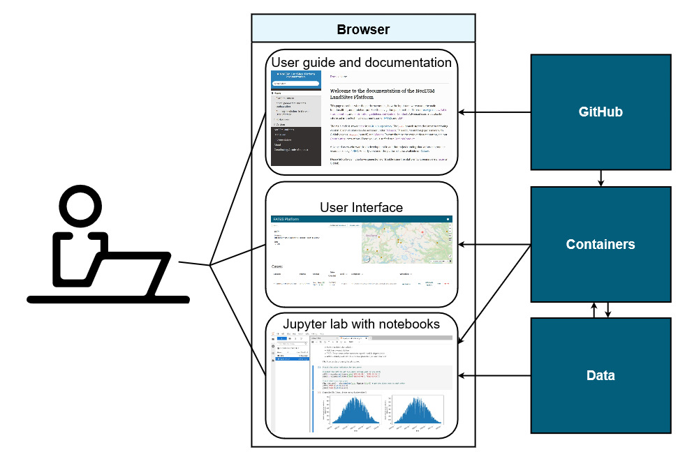

# User guide

This is the user guide for running point simulations with the [NorESM LandSites Platform](https://noresmhub.github.io/NorESM_LandSites_Platform/) 🌍

You will need to open two new windows in the process, so it's a good idea to use two screens or to make this window narrower so you can see both the user guide and another window next to it.


*After setup, users will typically use this user guide & documentation, the user interface, and the Jupyter lab in different browser tabs. This is supported by code on GitHub, Docker containers creating a virtual computing environment, and input data stored on an external server.*

***********************************************

## TL;DR quick start 🏃‍♀️🏃‍♂️

If you have already completed [first-time setup](https://noresmhub.github.io/noresm-land-sites-platform/user_guide/#0-prerequisites-first-time-setup) and know what you are doing, here is the extremely quick user guide. In a terminal where you have the repository: 
    
    $ cd NorESM_LandSites_platform 
    $ docker-compose up
    
Wait until the terminal messages stop. Open the container GUI: [localhost:8080](http://localhost:8080) and push buttons, and access jypyter notebooks on [localhost:8888](http://localhost:8888) 🎉


***********************************************

## Step by step guide for using the platform


### 0. Prerequisites (first time setup) 🌱

To use the NorESM LandSites Platform, you need to install [Git](https://git-scm.com/downloads "click the pc screen button if you are on Windows") (and make a user account) and [Docker desktop](https://www.docker.com/products/docker-desktop) before you can clone the [repository](https://github.com/NorESMhub/noresm-land-sites-platform "repository for the NorESM Land Sites platform") (= download platform scripts) and start working with the Docker container. If you don't want to make a GitHub account, you may try to download and unpack the repository manually instead with the `code` button and ´download zip´. Step by step (with steps in brackets only sometimes necessary, depending on your computer):

1. [Create a GitHub account](https://github.com/) (optional, but generally recommended)
2. Install Git on your machine. For Windows: https://gitforwindows.org/, other: https://github.com/git-guides/install-git
3. Install [Docker desktop](https://docs.docker.com/get-docker), might require restart
4. (Install Docker Compose; should already be included in the Docker installation described above for Mac and Windows: [install docker-compose](https://docs.docker.com/compose/install) )
5. (Remarks for Windows: You may have to install WSL2 (the 'two' is important here) manually if prompted. Follow the steps described [here](https://www.omgubuntu.co.uk/how-to-install-wsl2-on-windows-10). To open the Windows Command Prompt terminal as an administrator, type `cmd` into the Windows search bar located next to the Start Symbol (lower-left corner of the screen), right-click on 'Command Prompt', and select 'Run as administrator'. Also, note that some steps in the guide are executed in the 'Command Prompt' and some are executed in the 'Windows PowerShell'; to open the latter, type 'PowerShell' into the search bar and open as administrator. If Docker complains about you not belonging to the correct 'user group' after successful installation, follow the steps described [here](https://stackoverflow.com/questions/61530874/docker-how-do-i-add-myself-to-the-docker-users-group-on-windows-10-home)
6. Open file explorer and find a suitable folder to serve as working directory. This is where you will store the repository and installation files needed by the platform, as well as your output files (which may take up quite a bit of space!). Your working directory should be somewhere on your C: drive, for instance `C:/Users/yourusername` (and not on OneDrive, USB sticks or your overly-cluttered desktop 👀).
7. When you are in your chosen working directory, right-click and choose "Git Bash here". In the terminal that pops up, paste in the following line by right-clicking:


```
$ git clone https://github.com/NorESMhub/noresm-land-sites-platform.git --config core.autocrlf=input 
```


This will download (= clone) the repository (= folder structure and files) to your working directory. You can now see the folder and files in your file explorer. Most of the files can be opened in a text editor like Notepad if you want to look at their contents.

Once Git, Docker desktop and the repository are in place, you don't have to do this again. When  you are using the platform has been updated the next time you want to use it, you might want to download the updates by typing first `git pull` and then `docker-compose pull` into Git Bash from your local clone of the repository. 

### 1. Start the container 🧰

In the working directory where you have cloned the repository, open a terminal by right-clicking and choosing "Git Bash here" (or use the one you already have open if you just did the first time setup). Make sure you are inside the folder containing the `docker-compose.yaml` file (type `ls` and hit enter to list the files in the current folder; if you see noresm-land-sites-platform, you need to change directory into that folder by typing ´cd noresm-land-sites-platform´). Then write this command and hit enter to get the container up and running:

    $ docker-compose up

The first time you execute this command, a lot of files will be downloaded first and it might take some time. When the container is up and running, the bottom messages in your terminal will look something like the screenshot below (NB! Do not close the container by pressing `Ctrl+C`, only close it once you are finished with this user guide). Now you can access the container through your browser by opening this link (right-click and open in new tab or window): [localhost:8080](http://localhost:8080)


You can also see the container in the Docker desktop app under Containers/Apps.


### 2. Inside GUI: Set simulation settings ⚙️

Now you can open the graphical user interface (=GUI) at [localhost:8080](http://localhost:8080) for setting up and running simulations. This interface has access to the Docker container you started in step 1. If you are doing a quick test with [default platform settings](https://noresmhub.github.io/noresm-land-sites-platform/#settings-file), just pick a site and click  `create case` and then `run`. The GUI should look like this:


#### 2.1 Choose a site 

by clicking either a button or a point on the map!

#### 2.2 Download site data button (optional)

The `download site data` button allows you to download the input data for your selected site. The data is already available in the container, so you don't need to do this. We provide a notebook called `input_visualization.ipynb` which you can open in Jupyterlab on [localhost:8888](localhost:8888) to explore some of the data that goes in to a simulation. This is a good thing to do while your case is running (which might take some time).

#### 2.3 Create case

With the `create case` button, you can look at and edit some model settings and parameters as you create a new case. This is not an exhaustive list of possible changes (by far), but give you easy access to some options. All the boxes have default values for a quick but not especially realistic simulation.

The box that pops up with settings has four tabs:

- **CTSM** (=Community Terrestrial Systems Model) settings for general options like simulation period.
- **CLM / Namelist** settings where you can change CO2 concentration, switch some modules of/off.
- **CLM / Namelist / history** settings where advanced users can set how and when the simulation output is stored.
- **FATES** parameters where you can disable some Plant Functional Types (PFTs) and change some vegetation parameters.

Once you have created your case with the desired settings, it will appear in a list of cases with the case ID, status, creation date, grid information, component set, a link to view the settings you specified, and some buttons with more options. Pay attention to the Status, which will transition from pending to ready when the case has been built.

### 3. Run your simulations 👩‍💻

Once the case is ready, you can start the simulation with ´run´. There is a button to ´download´ the output when the run is finished, and to ´edit´ the settings and create a new case, or ´delete´ the case. Depending of how long you asked the model to run for (default is 1 year), and your hardware, the simulation can take some time ⏳. On a regular laptop, one year of simulation of a single site (= gridcell) might take ~5-20 minutes. Make sure your computer is not running other heavy programs simultaneously (like GIS, Photoshop or 1000 open browser tabs 👀). The Docker container you started in step 1 is performing the simulation using your local computer. Advanced users may also use the container on an HPC cluster to speed up long simulations.

> While you wait for the simulation to finish, you may like to inspect the model input data more closely. Open a new browser tab and go to the Docker container at [localhost:8888](http://localhost:8888). Navigate to the ´notebooks´ folder and open the ´input_visualization.ipynb´ notebook. It will guide you through some of the input data for the model. 

Soon your simulations will be finished! 🎉 Your screen might look something like this for two similar cases for the BOR1 site that have finished running:


If you got an error message somewhere along the way, please head over to our GitHub and write an [issue](https://github.com/NorESMhub/noresm-land-sites-platform/issues/new) describing what happened, what machine you are on (mac/windows/HPC etc.), and copy in the error message and any other relevant information. 

Output will be stored at time intervals you set (default is monthly), and can be downloaded from the container with the ´download´ button or viewed in the `data/output` folder in the container. 

### 4. Look at your output 📈

Output is stored in the `data/output` folder in the container, accessed on [localhost:8888](http://localhost:8888).

Nagivate to the ´notebooks´ folder and open the ´output_visualization.ipynb´ notebook. It guides you through some ways of looking at the model output, though there are many other ways to do this and much more model output available!

[Output files](https://noresmhub.github.io/noresm-land-sites-platform/#postprocess) can alternatively be opened in Panoply, R, or using python on your local computer.

### 5. Close the container

NB! The container will continue to run unless you stop it. When you are finished with simulations and output processing and downloading things you might need offline, go back to your Git Bash terminal and press ´Ctrl+c´.

***************************************************


Please help us by reporting errors and questions on our [issues page](https://github.com/NorESMhub/noresm-land-sites-platform/issues/new). 


***************************************************

[](https://www.noresm.org/)
[](https://www.mn.uio.no/geo/english/research/projects/emerald/)
[](https://www.mn.uio.no/geo/english/research/groups/latice/)
